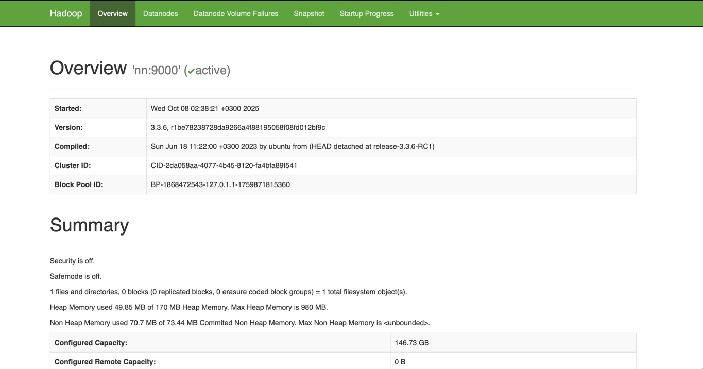
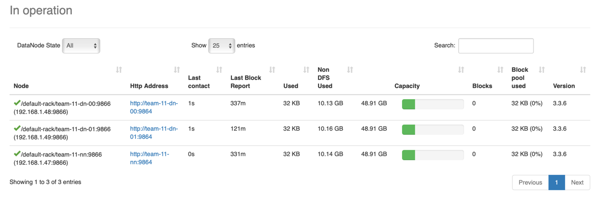
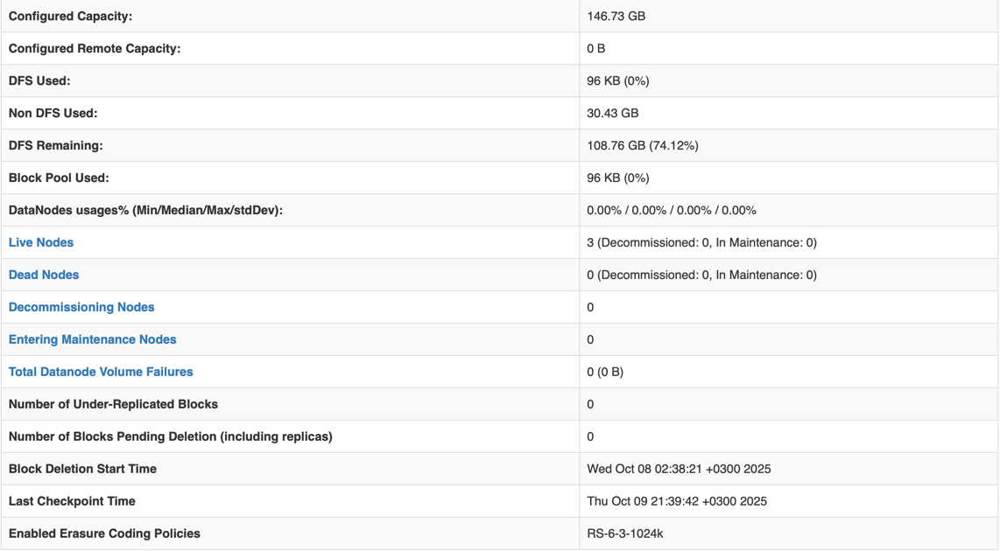
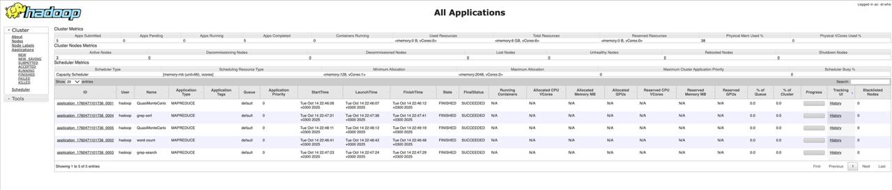

## Запуск HDFS-кластера

### Команды для запуска HDFS-кластера
Необходимо запустить скрипт

```bash 
./setup.sh
```

После этого, установить `ansible`, если он еще не установлен. 

```bash
sudo apt-add-repository --yes --update ppa:ansible/ansible
sudo apt install ansible
```

Запустить HDFS-кластер

```bash
ansible-playbook -i inventory.ini deploy-hdfs.yml -vvv
```

### Артефакты

Overview.



Список дата-нод в web-ui hadoop.



Summary



Jobs


