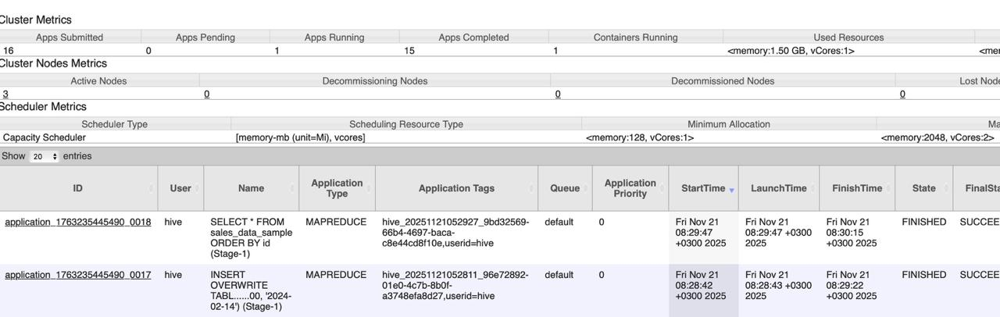
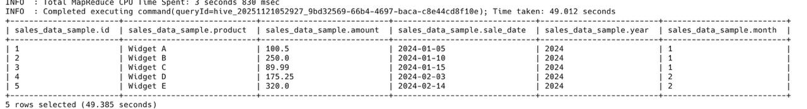

# Запуск Hive-кластера

## Запуск Hive

Inventory уже подготовлен и находится в файле `hdfs/inventori.ini`.

Запуск плейбука:

```bash
ansible-playbook -i hdfs/inventori.ini hive/deploy-hive.yml
```

## Структура переменных Hive

Основные переменные находятся в `hive/vars.yml`:

- `hadoop_install_dir`: путь к установленному Hadoop.
- `hadoop_user`: системный пользователь Hadoop.
- `java_home`: путь к установленной Java.
- `hive_version`: версия Hive (по умолчанию `4.0.0-alpha-2`).
- `hive_install_dir`: директория установки Hive (например `/opt/hive/apache-hive-4.0.0-alpha-2`).
- `hive_server2_port`: порт HiveServer2 (по умолчанию `10000`).
- `hive_user`: системный пользователь, от которого запускаются процессы Hive.
- `hive_metastore_warehouse_dir`: HDFS‑директория по умолчанию для таблиц.
- `hive_scratch_dir`: HDFS‑директория для временных файлов Hive.
- `postgresql_host`, `postgresql_port`, `postgresql_db`, `postgresql_user`, `postgresql_password`: параметры подключения к PostgreSQL‑метастору.
- `hive_metastore_uri`: thrift‑URI метастора 

Менять поведение развёртывания и старта Hive рекомендуется через редактирование этого файла.

## Скрипты

Скрипты находятся в папке `hive/scripts` и предназначены для быстрой работы с партиционированными таблицами и демо‑данными.

### `create-partitioned-table.sh`

Скрипт создаёт новую **партиционированную таблицу** в Hive с произвольной схемой.

Основные параметры (ключи CLI):
- `-d, --database` — имя базы данных (по умолчанию `default`).
- `-t, --table` — имя таблицы (**обязательный параметр**).
- `-p, --partition` — определение партиций, например: `"year int, month int"` (**обязательный параметр**).
- `-c, --columns` — список колонок таблицы без партиций, например: `"id int, product string, amount double, sale_date string"` (**обязательный параметр**).
- `-s, --storage` — формат хранения (`parquet`, `orc`, `textfile`), по умолчанию `parquet`.
- `-l, --location` — путь в HDFS, где будут лежать данные таблицы; если не указан, используется
  `/user/hive/warehouse/<database>.db/<table>`.

Что делает скрипт:
1. Создаёт базу данных, если её нет (`CREATE DATABASE IF NOT EXISTS`).
2. Переключается в неё (`USE <database>`).
3. Дропает таблицу, если она уже существует (`DROP TABLE IF EXISTS`).
4. Создаёт новую партиционированную таблицу в выбранном формате и с указанной локацией.
5. После успешного создания выводит структуру таблицы командой `DESCRIBE`.

Пример запуска:
```bash
./scripts/create-partitioned-table.sh \
  -d analytics \
  -t sales_data \
  -p "year int, month int" \
  -c "id int, product string, amount double, sale_date string" \
  -s parquet
```

Скрипт подключается к уже запущенному HiveServer2 по JDBC `jdbc:hive2://nn:10000` и выполняет все команды через `beeline` от имени пользователя `hive`.

### `insert-sample-data.sh`

Скрипт создаёт **демонстрационную партиционированную таблицу** и заполняет её тестовыми данными, которые используются в примерах и на скриншотах.

Параметры:
- `-d, --database` — имя базы данных (по умолчанию `sample_db`).
- `-t, --table` — имя таблицы (по умолчанию `sales_data_sample`).

Что делает скрипт:
1. Создаёт базу данных (`CREATE DATABASE IF NOT EXISTS`).
2. Создаёт, если нужно, таблицу `sales_data_sample` со схемой:
   - `id int`
   - `product string`
   - `amount double`
   - `sale_date string`
   и партициями `year int, month int`, хранимыми в формате `PARQUET`.
3. Выполняет два `INSERT OVERWRITE` в партиции:
   - `year=2024, month=1` — три строки с продуктами A, B, C;
   - `year=2024, month=2` — две строки с продуктами D, E.
4. После успешной вставки запускает проверочный запрос:
   `SELECT * FROM <table> ORDER BY id;`,
   чтобы визуально увидеть загруженные данные.

Пример запуска с параметрами по умолчанию:
```bash
./scripts/insert-sample-data.sh
```

Именно результат этого скрипта показан на артефакте `result_of_select_job.jpg`.

### `load-partitioned-data.sh`

Скрипт загружает **данные из локального файла** в выбранную партицию уже существующей партиционированной таблицы.

Параметры:
- `-d, --database` — имя базы данных (по умолчанию `default`).
- `-t, --table` — имя целевой таблицы (**обязательный параметр**).
- `-f, --file` — путь к локальному файлу с данными (**обязательный параметр**).
- `-p, --partition` — значение партиций, например: `"year=2024,month=1"` (**обязательный параметр**).
- `-o, --overwrite` — если указан, выполняется `LOAD DATA ... OVERWRITE`, иначе `LOAD DATA ... INTO`.

Алгоритм работы:
1. Проверяет существование локального файла.
2. Создаёт во временной области HDFS staging‑директорию вида
   `/tmp/hive_staging/<database>/<table>/<timestamp>`.
3. Загружает файл в staging‑директорию командой `hdfs dfs -put` от пользователя `hadoop`.
4. Вычисляет фактический путь загруженного файла в HDFS.
5. Формирует и выполняет через `beeline` команду:
   `LOAD DATA INPATH '<staged_file>' [OVERWRITE] INTO TABLE <table> PARTITION (<partition_values>);`
6. При успешной загрузке выполняет `SELECT COUNT(*) FROM <table> WHERE <partition_filter>;`
   чтобы проверить, что строки попали в нужную партицию.
7. В конце удаляет staging‑директорию из HDFS.

Пример загрузки CSV‑файла в партицию `year=2024,month=1` с перезаписью:
```bash
./scripts/load-partitioned-data.sh \
  -d sample_db \
  -t sales_data_sample \
  -f /tmp/sales_2024_01.csv \
  -p "year=2024,month=1" \
  -o
```

Все скрипты предполагают, что Hive‑кластер уже запущен (Metastore и HiveServer2 работают, HDFS и YARN доступны) и параметры `HIVE_HOME`, `HADOOP_HOME`, `JAVA_HOME`, `JDBC_HIVE` внутри скриптов соответствуют текущему окружению кластера.

## Артефакты

В каталоге `hive/artefacts` лежат скриншоты, подтверждающие успешный запуск и работу Hive.

Скриншот, подтверждающий успешность запуска hive джоб.



Скриншот результата выполнения запроса `SELECT * FROM sales_data_sample ORDER BY id;` в клиенте Hive (beeline):




